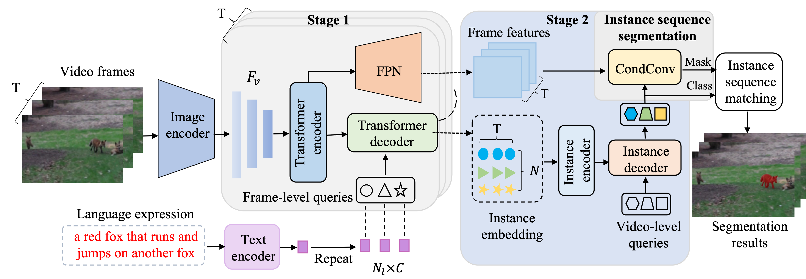

The official implementation of the [**STHQ**] (https://www.sciengine.com/SSI/doi/10.1360/SSI-2023-0030;JSESSIONID=bd630429-84e7-4dc5-aa63-89639d14d478):

<h1>
<b>
Spatio-temporal hierarchical query for referring   video object segmentation
</b>
</h1>

### Abstract

本文针对当前指代视频目标分割方法缺乏目标时空一致性建模和目标时空表征学习不足等问题, 进行了深入的研究, 提出了基于时空层级查询的指代视频目标分割方法 (STHQ). 本文将指代视频目标分割看作基于查询的序列预测问题, 并提出两级查询机制来进行目标的时空一致性建模和时空特征学习. 在第一阶段, 本文提出了帧级空间信息提取模块, 该模块使用语言特征作为查询独立地和视频序列中的每一帧在空间维度进行信息交互, 生成包含目标空间信息的实例嵌入; 在第二阶段，本文提出时空信息聚合模块, 该模块使用视频级的可学习查询嵌入和第一阶段生成的实例嵌入在时空维度进行信息交互, 生成具有时空表征信息的视频级实例嵌入; 最后, 视频级实例嵌入线性变换为条件卷积参数, 并和视频序列中的每一帧进行卷积操作，生成目标的掩码预测序列. 在该领域的三个基准数据集上的实验结果表明, 本文提出的STHQ方法超越了现有的方法实现了最佳的性能.

## Requirements

We test the codes in the following environments, other versions may also be compatible:

- CUDA 11.1
- Python 3.7
- Pytorch 1.8.1

## Installation

Please refer to [install.md](docs/install.md) for installation.

## Data Preparation

Please refer to [data.md](docs/data.md) for data preparation.

## Get Started

You can download the pretrained weights and the trained weights from [model zoo](https://drive.google.com/drive/folders/1T0b4U06CgbVbnSYzyt-tHd9z74ZH3322?usp=sharing)

Please see [Ref-YTVOS.md](docs/Ref-Youtube-VOS.md), [Ref-DAVIS17.md](docs/Ref-DAVIS17.md), [A2D-Sentences.md](docs/A2D-Sentences.md) and [JHMDB-Sentences.md](docs/JHMDB-Sentences.md) for details.

<!-- pretrain.sh, train.sh and test.sh for details. -->

## Acknowledgement

This repo is based on [ReferFormer](https://github.com/wjn922/ReferFormer). Thanks for the wonderful work.
